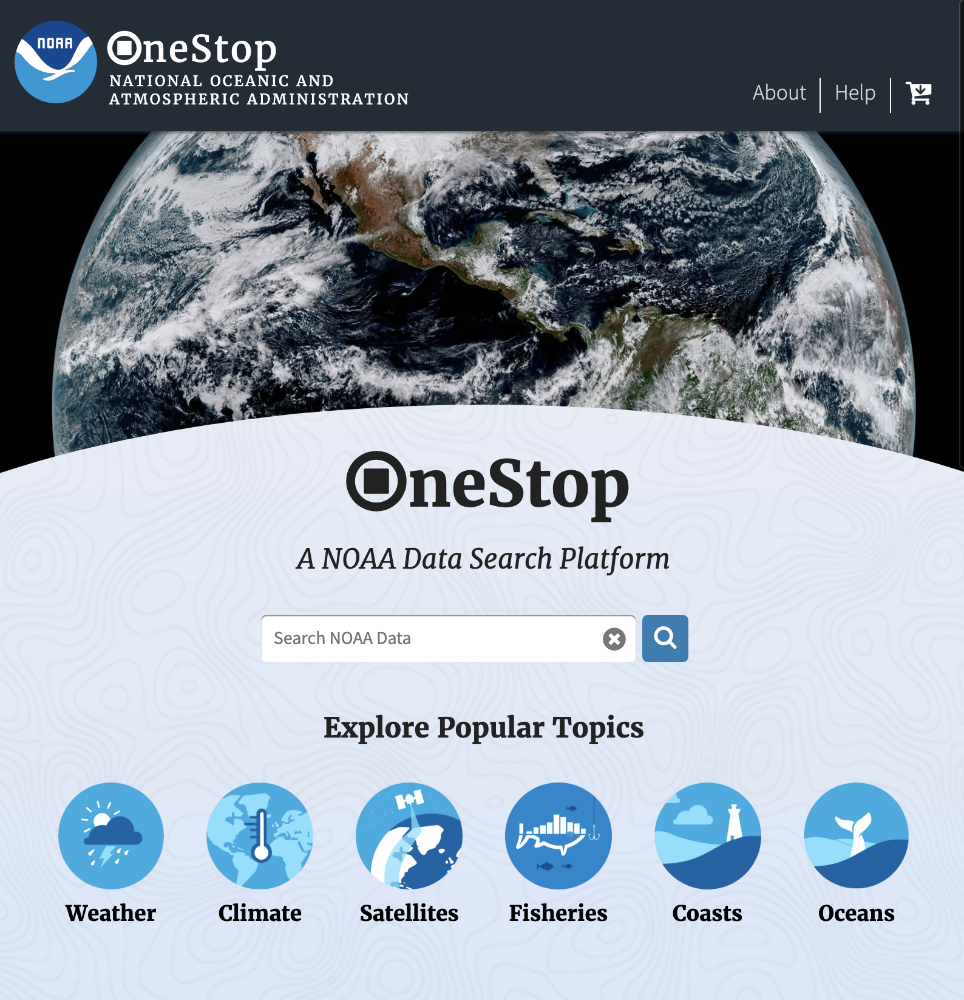

  

<h3 align="center">OneStop</h3>

  distributed, scalable, event-driven database and search engine for environmental data.
   
  <a href="https://cedardevs.github.io/onestop/"><strong>Explore OneStop docs »</strong></a>
   
   
  <a href="https://github.com/cedardevs/feedback/issues/new?template=bug.md">Report bug</a>
  ·
  <a href="https://github.com/cedardevs/feedback/issues/new?template=feature.md&labels=feature">Request feature</a>

## Table of contents

- [Project Overview](#project-overview)
- [Navigating The Documentation](#navigating-the-documentation)
  - [By User Type](#by-user-type)
  - [By Project Component](#by-project-component)
- [External Documentation](#external-documentation)
- [Further Issues or Questions](#further-issues-or-questions)

## Project Overview
OneStop is an open-sourced metadata storage, management, and discovery system built by CIRES researchers on a grant from the NOAA National Centers for Environmental Information. As data volume increases year after year, OneStop's adherence to cloud native design principles alleviates concerns with scalability and access.

The project is composed of four high level "components":
* An event stream/database for receiving, storing, and enabling flexible downstream use of metadata 
* A feature-rich RESTful Search API built from the raw event stream metadata
* A state-of-the-art browser-based User Interface (UI) that has accessibility built into every feature, and,
* A command line interface (CLI) enabling more efficient script and algorithm execution when reliant on information retrieved from the Search API

You can check out OneStop in action while exploring NOAA's Earth science data offerings at [NOAA's OneStop](https://data.noaa.gov/onestop/) search portal. If the latest features in progress are what you're after, however, take a peek at our [test host](https://sciapps.colorado.edu/onestop/). *Keep in mind the latter could be broken at any time as it represents what's currently under development.*

## Navigating The Documentation
OneStop has an enormous amount to offer, but it can be difficult to know how and where to get started with a project that has so many moving parts.  With that in mind, we have laid out some navigational paths through our documentation based on the user type and project component. 

### By User Type
What's important to you when using OneStop varies significantly based on what you need to accomplish. Select the role below that most closely represents you to get started.
* [Public User](public-user.md)
  * You're using the UI, API, or CLI in order to find data
* [Metadata Manager](metadata-manager.md)
  * You're responsible for loading or maintaining metadata records
* [Operator](operator.md)
  * You're deploying, upgrading, or maintaining an instance of OneStop in a production setting
* [External Developer](external-developer.md)
  * You're developing external software that needs to interact with a running OneStop deployment
* [Internal Developer](internal-developer.md)
  * You're contributing to the OneStop code or even just trying to run a local instance on your personal machine

### By Project Component
If you're interested in learning about the finer details of the "components" described above in the overview, head over to our [Architectural Overview](/onestop/architectural-overview) page to begin your deep-dive journey.

## External Documentation
Swagger docs describing the Search API are currently hosted externally from GitHub or running public instances of OneStop.
* [Swagger API Docs - 2.0.0](https://app.swaggerhub.com/apis/cedardevs/one-stop_search_api/2.0.0)

## Further Issues or Questions
If you have any questions, comments, or have spotted an issue with the code or docs, please open [an issue](https://github.com/cedardevs/feedback/issues) via Github Issues on our Feedback repository. This repository is issue-only and intentionally meant to prevent external feedback from being lost in our day to day tasks.

Feel free to peruse the [OneStop issues](https://github.com/cedardevs/onestop/issues) as well to stay informed of our work in progress and issues we're aware of.

