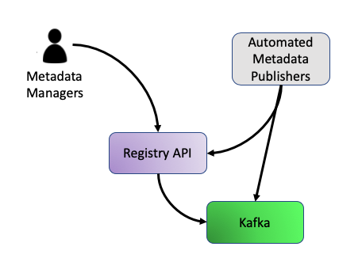
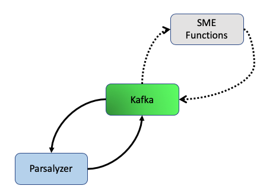
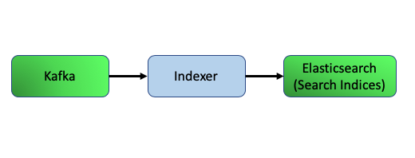
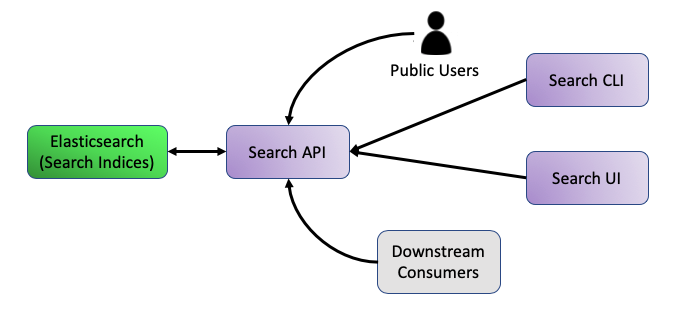

<a href="/onestop/api">OneStop API</a>

**Estimated Reading Time: 15 minutes**
# Architectural Background

## Table of Contents
* [OneStop Workflow](#onestop-workflow)
    * [Step One: Loading](#step-one-loading)
    * [Step Two: Transformation](#step-two-transformation)
    * [Step Three: Search Indexing](#step-three-search-indexing)
    * [Step Four: Search Access](#step-four-search-access)
* [References: Concepts](#references-concepts)
* [References: Specifics](#references-specifics)
                
This project embraces the event-streaming paradigm reflected in the [Kappa Architecture](https://eng.uber.com/kappa-architecture-data-stream-processing/):

1. All state changes are recorded as immutable events in an ordered, distributed log
1. Business logic is implemented in distributed processing algorithms that operate on the stream of events
1. Views of the output data are deterministically materialized in appropriate data stores to support querying use cases,
e.g. an inverted index for searching, a key-value store for random access, etc.

## OneStop Workflow
The flow of metadata through OneStop can be summarized in 4 conceptual steps: loading, transformation, search indexing, and search access. The following diagrams for each step are color coded.

Anything grey is external to a OneStop deployment, and represents places where non-required externally developed tools could connect to OneStop. Examples are tools migrating metadata into OneStop, subject matter expert scripts that can be triggered from within the OneStop workflow to enhance received metadata, and custom user interfaces using the Search API.

Non-gray elements are all components of a full OneStop deployment. Green elements -- Kafka and Elasticsearch -- are the 3rd party software components that OneStop is built on top of. Only privileged users (like those that are responsible for managing the servers a deployment runs on) should ever access or configure these components directly. Blue components connect to Kafka and Elasticsearch and facilitate many of the workflow steps, however, these components cannot be interacted with directly. Finally, the purple components are access points into the OneStop system by public users (Search API, UI, and CLI) and trusted users responsible for the metadata contained within OneStop ([Registry API](registry-api)).

### Step One: Loading

Metadata is loaded into OneStop either manually by Metadata Managers via the Registry API, or automated through external software that also communicates to the Registry API or interfaces directly to Kafka by writing to an input topic.

### Step Two: Transformation

Once metadata lands on the input Kafka topics, automatic processes are triggered to parse it into the Discovery format and analyze individual fields from that format. If a datastream or collection has been setup for it, optional SME functions can be triggered for metadata enhancement prior to parsing and analysis.

### Step Three: Search Indexing

After metadata has been parsed and analyzed, it is put onto a Kafka topic from which the Indexer reads. The Indexer assesses each record for search readiness, and after successful validation pushes the records into their respective search indices on Elasticsearch. Records that do not pass validation will not be indexed until the errors are resolved.

### Step Four: Search Access

Metadata that passes validation steps and is indexed is now accessible from the [Search API](search-api). The [Search API](search-api) services requests from the Search UI, Search CLI, and external users and consumers, translating them into Elasticsearch queries against the appropriate search index.

More info on the [Search API](search-api)

## Metadata CRUD: The Registry API
Your metadata might arrive into OneStop in a variety of ways, but once it gets added to the system the [Registry API](registry-api) is the front door for basic CRUD operations (Create, Read, Update, Delete). However, depending on the external tool, if any, used to connect your data with OneStop, you may only ever need to familiarize yourself with read operations. That being said, the Registry is a straightforward RESTful API application, so operations are performed with HTTP requests -- `GET` (read), `POST` (create), `PUT` (update), `PATCH` (also for updating), and `DELETE`. The functionality of the Registry is covered in depth at a later point in the [metadata loading guide](/onestop/metadata-manager/v3/onestop-metadata-loading).

More Info on the [Registry API](registry-api)

## Metadata Storage: Kafka
The core of the metadata storage is [Apache Kafka](https://kafka.apache.org/intro). Kafka is an open-source distributed stream-processing software platform that enables data to be transported, stored, and transformed in real-time. Kafka can be scaled horizontally, even across data centers, while simultaneously processing and storing data quickly and compactly. While it is true that OneStop stores metadata in Kafka, the use of it is not limited there. Metadata movement to/from external systems, parsing, analysis, and transformation is all facilitated by Kafka. As a metadata manager, chances are very slim you'll interact directly with Kafka, but knowing it's there gives confidence your metadata is being securely, durably, and efficiently stored.

## Metadata Analysis: Kibana
Once metadata is stored, some parsing and analysis steps automatically run on your input. The generated content is available from some Registry API endpoints but we have also created some [Kibana](https://www.elastic.co/guide/en/kibana/current/introduction.html) dashboards to visualize metadata quality for multiple records at a time. These views are ideal for inspecting an entire collection's granules all at once, and allowing you to narrow down on filtered subsets of interest. From here you can quickly determine if an issue exists or if everything is looking fantastic. Check out the (Coming soon...) [Kibana Dashboards](kibana-dashboards) guide for more information.

## Metadata Searching: Search UI, API, and CLI
Finally, after all your hard work stewarding your data and generating high-quality metadata to describe it all, you and others can search for and discover it in the Search UI, API, and CLI. Each of these is covered in depth over in the [Public User Navigation Guide](../public-user.md). The UI is meant to help a variety of people explore and discover data across an entire organization. The API and CLI, however, are more likely to be used by power users: those building a custom site for a subset of data; those downloading large quantities of data; those building new, higher level products from existing data, etc. While a very small amount of information can result in your metadata making it all the way to these discovery tools, there is definitely a lot of potential to enhance your metadata's discoverability. The last documents in this guide go over the ways you can take a pulse on your input and figure out how to unlock the full potential of each search feature. Check out [Ingest To Discoverability: Best Practices](best-practices.md) to get started on making your metadata stand out.

## References: Concepts

- [Event Sourcing](https://martinfowler.com/eaaDev/EventSourcing.html) - Martin Fowler
- [Command Query Responsibility Segregation](https://martinfowler.com/bliki/CQRS.html) - Martin Fowler
- [The Log: What every software engineer should know about real-time data's unifying abstraction](https://engineering.linkedin.com/distributed-systems/log-what-every-software-engineer-should-know-about-real-time-datas-unifying) - Jay Kreps
- [Turning the Database Inside Out](https://www.youtube.com/watch?v=fU9hR3kiOK0) - Martin Kleppmann
- [How to Beat the CAP Theorem](http://nathanmarz.com/blog/how-to-beat-the-cap-theorem.html) - Nathan Marz
- [Questioning the Lambda Architecture](https://www.oreilly.com/ideas/questioning-the-lambda-architecture) - Jay Kreps
- [Why local state is a fundamental primitive in stream processing](https://www.oreilly.com/ideas/why-local-state-is-a-fundamental-primitive-in-stream-processing) - Jay Kreps
- [Why Avro For Kafka Data?](https://www.confluent.io/blog/avro-kafka-data/) - Jay Kreps

## References: Specifics

- [Introduction to Kafka](https://kafka.apache.org/intro)
- [Event sourcing, CQRS, stream processing and Apache Kafka: What’s the connection?](https://www.confluent.io/blog/event-sourcing-cqrs-stream-processing-apache-kafka-whats-connection/)
- [Introducing Kafka Streams](https://www.confluent.io/blog/introducing-kafka-streams-stream-processing-made-simple/)
- [Yes, Virginia, You Really Do Need a Schema Registry](https://www.confluent.io/blog/schema-registry-kafka-stream-processing-yes-virginia-you-really-need-one/)
- This entire [series](https://www.confluent.io/blog/data-dichotomy-rethinking-the-way-we-treat-data-and-services/)
from [confluent](https://www.confluent.io/blog/build-services-backbone-events/)
which [culminates](https://www.confluent.io/blog/apache-kafka-for-service-architectures/)
in a [walkthrough](https://www.confluent.io/blog/chain-services-exactly-guarantees/)
of [building](https://www.confluent.io/blog/messaging-single-source-truth/)
a streaming [system](https://www.confluent.io/blog/leveraging-power-database-unbundled/)
is [great](https://www.confluent.io/blog/building-a-microservices-ecosystem-with-kafka-streams-and-ksql/).

<a href="#">Top of Page</a>
