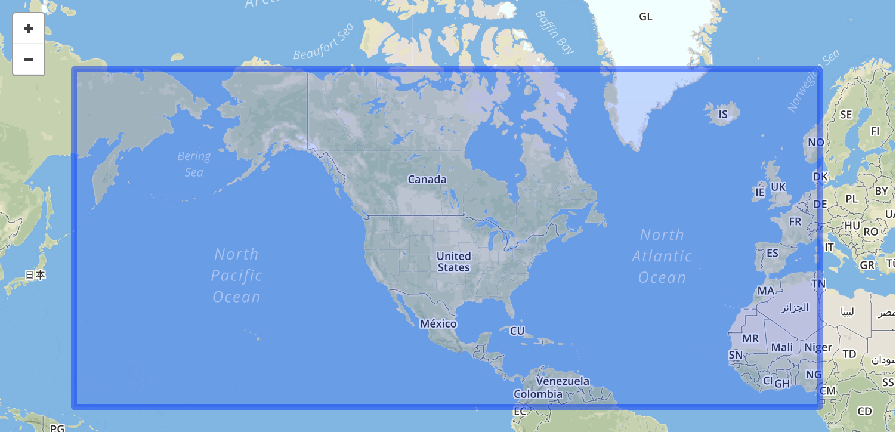
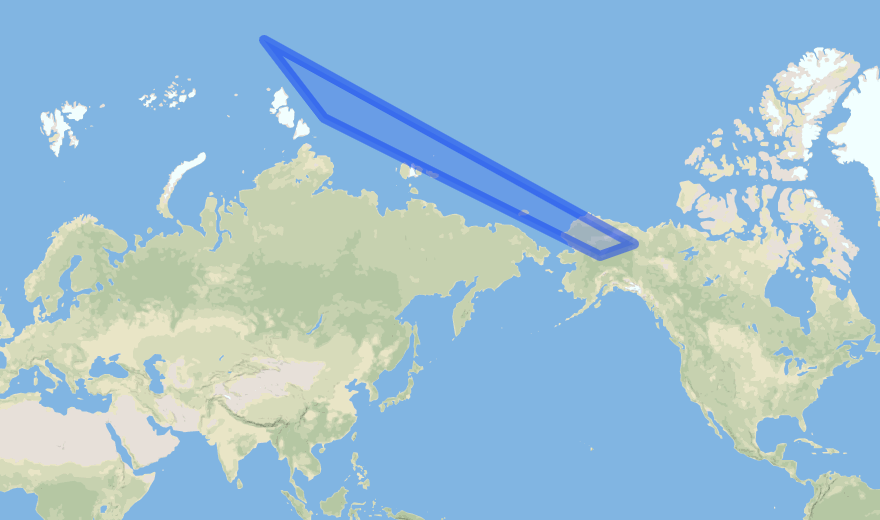
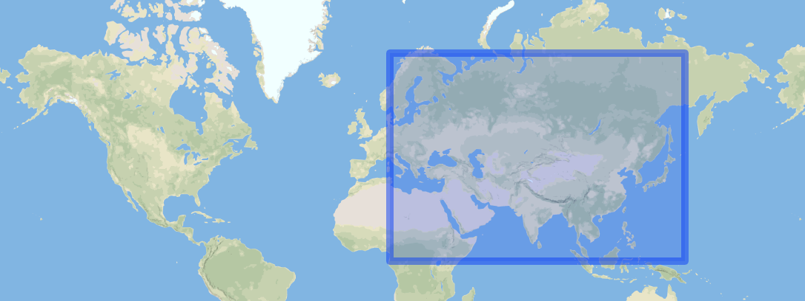
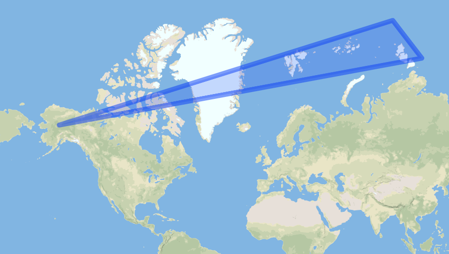
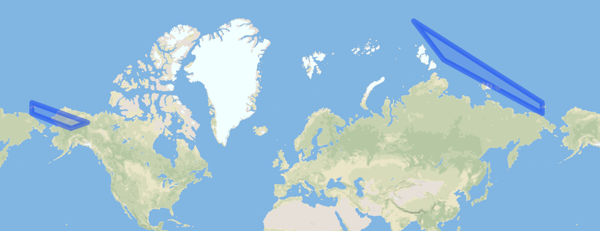

<div align="center"><a href="/onestop/public-user">Public User Documentation Home</a></div>
<hr>

**Estimated Reading Time: 5 minutes**

# Geometries at the Antimeridian

OneStop does not support geometries that cross both the antimeridian and prime meridian, particularly bounding boxes, if those polygons are represented in GeoJSON with numerically discontinuous longitudes. For smaller geometries which cross the antimeridian, OneStop does support them, but other related services may not.

Special care must be taken for geometries that cross the antimeridian. This is true for both loading data into the system, as well as for spatial queries.

There are several possible solutions, but it is the responsibility of the data provider to provide geometries correctly.

Note: in the case of providing data via `EX_GeographicBoundingBox` in ISO records, no changes need to be made. OneStop uses GeoJSON MultiPolygon automatically for bounding boxes that cross the antimeridian.

## Table of Contents

- [Examples](#examples)
  - [Misinterpretations](#misinterpretations)
  - [Correction with MultiPolygons (recommended)](#correction-with-multipolygons-recommended)
  - [Correction with Shifted Longitudes](#correction-with-shifted-longitudes)
- [References](#references)

## Examples

Consider this bounding box used in a query:



Or a granule with this polygon showing the arc of data from a polar satellite:



### Misinterpretations

It may be tempting to write this bounding box with the polygon:
```
{
  "type": "Polygon",
  "coordinates": [
    [
      [150, 0],
      [10, 0],
      [10, 70],
      [150, 70],
      [150, 0]
    ]
  ]
}
```

and the polygon with:
```
{
  "coordinates": [
    [
      [89.03714, 83.41194],
      [110.17727, 79.45783],
      [-152.8746, 65.788704],
      [-140.4437, 67.28255],
      [89.03714, 83.41194]
    ]
  ],
  "type": "Polygon"
}
```

However, due to the numerical discontinuity at &#177;180, the bounding box will be interpreted by OneStop as:



And some tools and services may treat the polygon as though it is this one instead:



### Correction with MultiPolygons (recommended)

The preferred way to write GeoJSON geometries to prevent these errors is by splitting into a MultiPolygon. This is to support interoperability between systems that require longitudes be restricted to values in the range &#177;180.


Here is the GeoJSON for the Bounding Box in MultiPolygon form:
```
{
  "type": "MultiPolygon",
  "coordinates": [
    [
      [
        [150, 0],
        [180, 0],
        [180, 70],
        [150, 70],
        [150, 0]
      ]
    ],
    [
      [
        [-180, 0],
        [10, 0],
        [10, 70],
        [-180, 70],
        [-180, 0]
      ]
    ]
  ]
}
```



Here is the GeoJSON for the Polygon in MultiPolygon form:
```
{
  "type": "MultiPolygon",
  "coordinates": [
    [
      [
        [-180, 69.61322862],
        [-152.8746, 65.788704],
        [-140.4437, 67.28255],
        [-180, 72.1708667],
        [-180, 69.61322862]
      ]
    ],
    [
      [
        [180, 72.1708667],
        [89.03714, 83.41194],
        [110.17727, 79.45783],
        [180, 69.61322862],
        [180, 72.1708667]
      ]
    ]
  ]
}
```

### Correction with Shifted Longitudes

Another solution is to shift some of the coordinates, so that they have the correct relative values on a number line.

Although OneStop searching will work correctly with all of the following GeoJSON, loading data with these may cause errors for other tools and services that rely on OneStop.

Bounding Box:
```
{
  "type": "Polygon",
  "coordinates": [
    [
      [-210, 0],
      [10, 0],
      [10, 70],
      [-210, 70],
      [-210, 0]
    ]
  ]
}
```
or
```
{
  "type": "Polygon",
  "coordinates": [
    [
      [150, 0],
      [370, 0],
      [370, 70],
      [150, 70],
      [150, 0]
    ]

  ]
}
```

Polygon:
```
{
  "coordinates": [
    [
      [89.03714, 83.41194],
      [110.17727, 79.45783],
      [207.1254, 65.788704],
      [219.5563, 67.28255],
      [89.03714, 83.41194]
    ]
  ],
  "type": "Polygon"
}
```
or
```
{
  "coordinates": [
    [
      [-270.96286, 83.41194],
      [-249.82273, 79.45783],
      [-152.8746, 65.788704],
      [-140.4437, 67.28255],
      [-270.96286, 83.41194]
    ]
  ],
  "type": "Polygon"
}
```

## References

[GeoJSON Format](https://tools.ietf.org/html/rfc7946#section-3.1.9)
[GeoJSON Lint](http://GeoJSONlint.com/)
