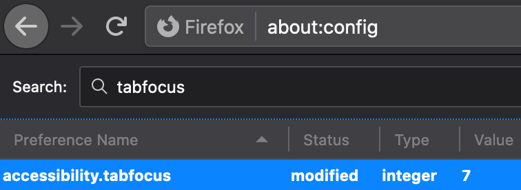

<a href="/onestop/public-user">Public User Documentation Home</a>

**Estimated Reading Time:**

# Keyboard Navigation Guide
OneStop UI features are fully accessible via use of the keyboard. A lot of functionality may be familiar to you if you're already a frequent user of keyboard features in general, but just in case, this guide covers how to use each feature of the OneStop UI completely mouse-free.

## Fixing Keyboard Focus in Firefox on Mac

If you encounter issues being able to focus via the keyboard on a Mac while using Firefox, there is likely an OS level preference causing this. There are two ways around this:

1. System Preferences
    - → Keyboard 
    - → Shortcuts (pane) 
    - → Check "all controls" radio button at bottom
1. Firefox Configuration
    - → Enter `about:config` into the URL bar 
    - → Right click in the table 
    - → New > Integer 
    - → Preference Name = "accessibility.tabfocus" 
    - → Value = 7

For more context on this issue, see this [Stack Overflow post](https://stackoverflow.com/questions/11704828/how-to-allow-keyboard-focus-of-links-in-firefox#answer-11713537)

<a href="#">Top of Page</a>
