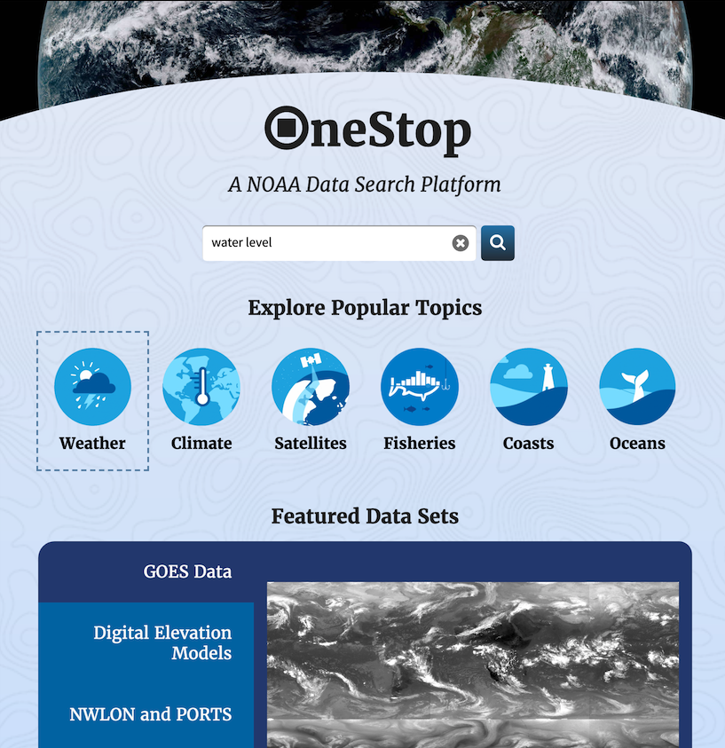
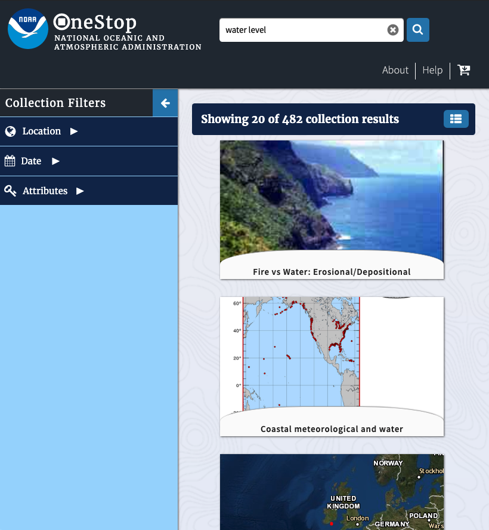
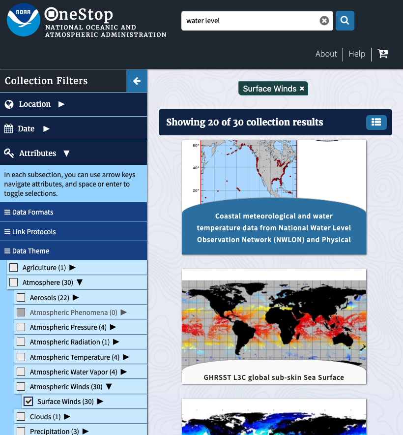
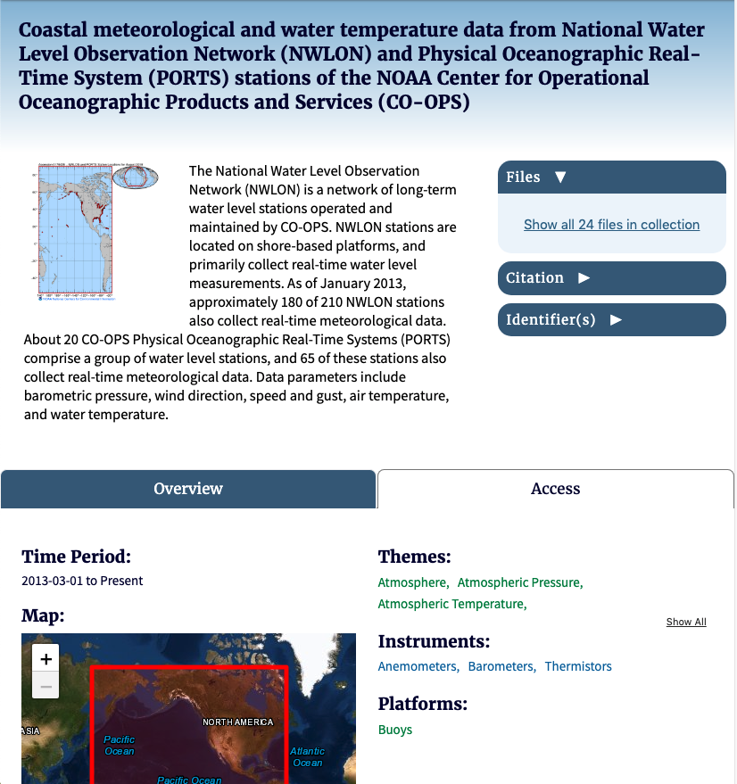
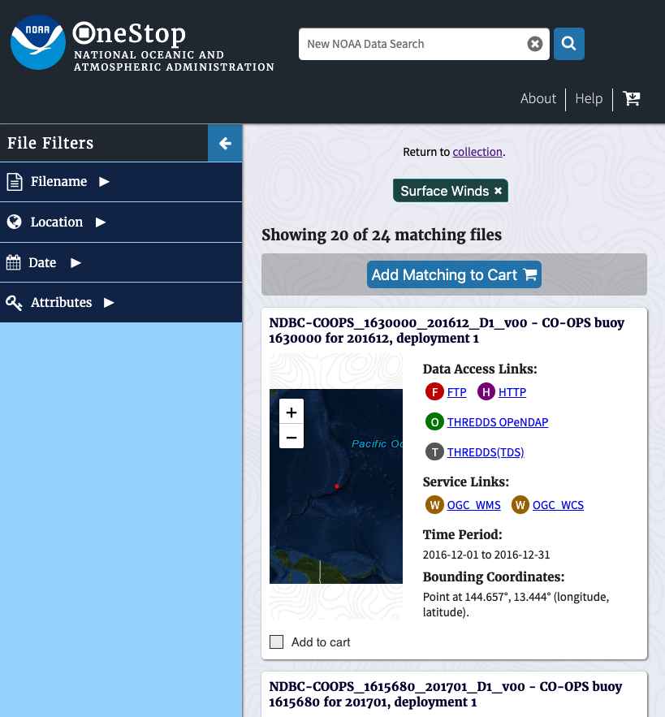
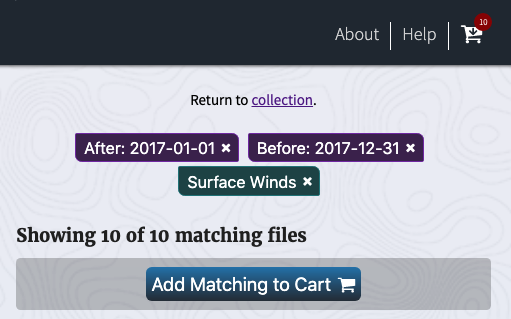
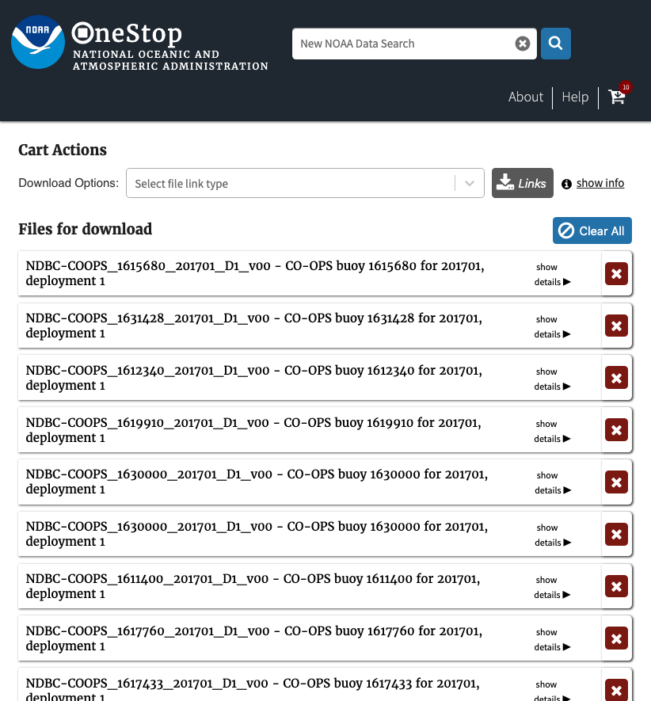

<a href="/onestop/public-user">Public User Documentation Home</a>

**Estimated Reading Time: 5 minutes**

# User Interface Quick Start Guide
The OneStop UI is designed to be useful and intuitive for a large cross-section of end-users: scientists, researchers, students, and the average person in general. It's a great starting point when trying to discover and download scientific data, and is designed to help users find more specific services of interest as well.

The UI leverages a modern build process and features, the output of which has been tested and determined compatible with the most recent versions of the following browsers (as of May 2020):
* Chrome
* Firefox
* Edge
* Safari

This quick start guide is meant for a true beginner to the website's functionality, and will only briefly touch on features -- the goal is to demonstrate the user experience from start to finish. If you're interested in a specific feature, we've covered them all in depth on the next page, [UI Features In Depth](/onestop/public-user/ui/features-in-depth).

## Walkthrough
In terms of the UI, the best way to get started is really just to dive right in! You can follow along with the steps on the official [NOAA deployment site](https://data.noaa.gov/onestop/) or our [development deployment](https://cedardevs.org/onestop). Keep in mind that result ordering and counts may not match exactly to what is shown in the guide images.

### Step One: The Initial Search Query
From the landing page, there are 3 ways to populate the initial text query:
1. Enter your query in the text bar, followed by `Enter` or clicking the magnifying glass button.
1. Click one of the options under the `Explore Popular Topics` header.
1. Click one of the options on the `Featured Data Sets` carousel.

We'll use the query text field and search for the term `water level`.

**Note**: Check out that dashed line around the `Weather` icon. The UI fully supports keyboard navigation, and the current focus is frequently denoted by a dashed line (other visual focus cues are sometimes used when the dashed line is otherwise more difficult to discern). A later guide in this series covers keyboard navigation in depth.

### Step Two: Assessing Initial Collection Results
You've started exploring the data at last! The first results you encounter are collection results. Collections are a high level grouping of similar data files -- they can represent all the data gathered by a single instrument on a satellite to a poster about a hurricane, and everything in between. Depending on the specificity of your query, the number of collection results returned can vary widely.

As you can see below, we found 485 collections matching our search term, and they seem to all be quite different...

### Step Three: Filtering Collection Results
On the left hand side of the page you'll notice the `Collection Filters` panel. There are three general types of filters available to narrow your results:
* `Location` -- Spatial parameters that should match the results
* `Date` -- Temporal parameters that should match the results
* `Attributes` -- Keywords, access types, and file formats that should match the results

A deeper dive into every feature of the UI can be found on the next page in this documentation series.

In the meantime, let's narrow our results by applying a `Data Theme` keyword to our search. These keywords in particular are hierarchically organized, and any level of the hierarchy can be selected. We'll drill down to `Atmosphere > Atmospheric Winds > Surface Winds`, which will narrow our result set size down to 30.

### Step Four: Exploring A Collection
Results on OneStop are returned in relevance order. Click the tile for the first result to go to that collection's landing page.

The collection detail page summarizes several key details about a given collection. The title and description are fully presented, along with it's temporal and spatial bounds. Some high level collection access details are given, if available, on the `Access` tab view. If a collection has granules and they are indexed within OneStop, the top right of the detail page provides a link to all of them.

### Step Five: Exploring A Collection's Granules
Click on the `Show all 22 files in collection` link to start narrowing down specific granules (data files). The granule results page looks similar to the collection results page, but an additional filter is available and the tiles are now more detailed.

### Step Six: Filtering Granule Results
At this point, 22 matching files is a pretty small quantity that in reality is a quite reasonable number to download directly all at once. However, many of NOAA's OneStop holdings are collections with granule counts in the millions. For a case like that, taking advantage of `File Filters` can save you a lot of time and effort getting to the data you need.

For this guide, we'll narrow down our results to just the ones intersecting any date in the year 2017.

### Step Seven: Downloading Granules
Having applied a time filter to our search, we now have 10 matching files! It's time to download some data.

From this view, you can add files individually to your cart using the checkbox on the bottom left corner of a granule tile. Alternatively, use the `Add Matching to Cart` button (icon of a cart with a plus symbol) at the top of the results to select everything. We'll add all of our matches.

The shopping cart icon in the page header will now update to reflect the number of items in the cart.

Clicking that icon will take you to the cart page, where you can generate a list of link URLs for your matching files based on access type (HTTP, FTP, THREDDS, etc.) that you can use with the tool of your choice to retrieve the files.

<a href="#">Top of Page</a>
